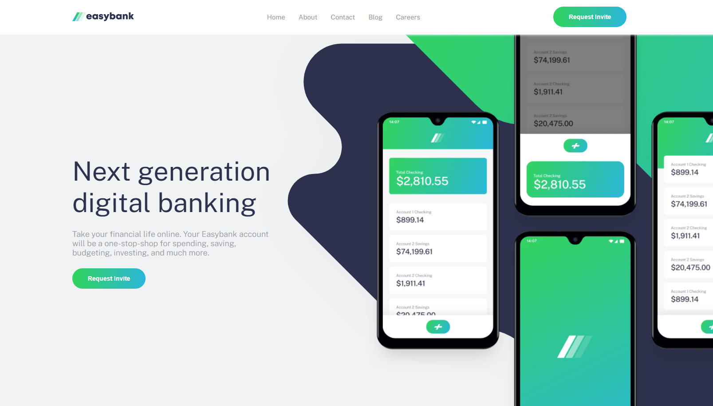
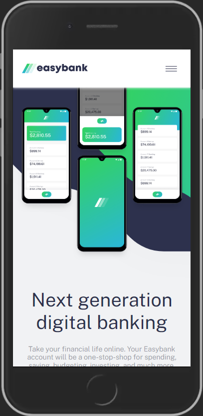
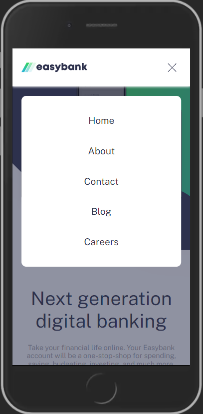

# Frontend Mentor - Easybank landing page solution

This is a solution to the [Easybank landing page challenge on Frontend Mentor](https://www.frontendmentor.io/challenges/easybank-landing-page-WaUhkoDN).

## Table of contents

- [Overview](#overview)
  - [The challenge](#the-challenge)
  - [Screenshot](#screenshot)
  - [Links](#links)
- [My process](#my-process)
  - [Built with](#built-with)
  - [What I learned](#what-i-learned)
- [Author](#author)

## Overview

### The challenge

Users should be able to:

- View the optimal layout for the site depending on their device's screen size
- See hover states for all interactive elements on the page

### Screenshot

### Links

- Solution URL: [GitHub](https://github.com/andre1dragos/bank_landing-page.git)
- Live Site URL: [Live](https://andre1dragos.github.io/bank_landing-page/)

## My process

### Built with

- Semantic HTML5 markup
- CSS variables
- Reusable CSS Classes
- Flexbox
- CSS Grid
- Mobile-first workflow
- Javascript
- Dry principle

### What I learned

- Grid layout
- Working with image alignment

## Author

- GitHub - [Dragos Andrei](https://github.com/andre1dragos)
- Frontend Mentor - [Dragos Andrei](https://www.frontendmentor.io/profile/andre1dragos)
